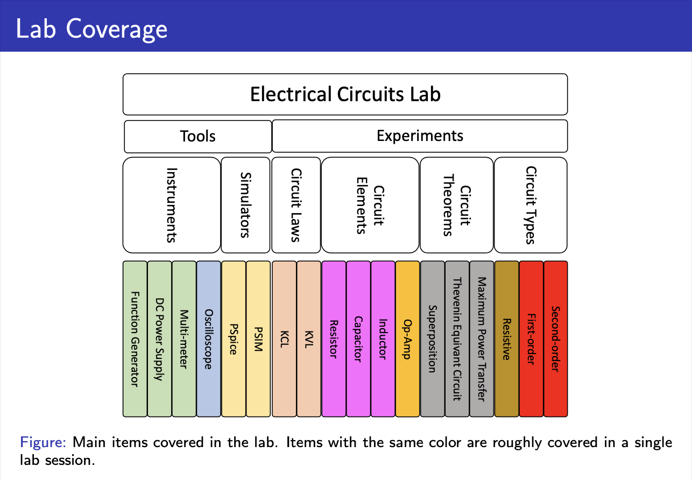

# Electrical Circuits Course Lab Reports

## Overview

This repository contains the lab reports for the Electrical Circuits I course, conducted in the Spring Term of 2024 at [Sharif University of Technology](https://en.sharif.edu). The course is lectured by [Dr. Hadi](https://ee.sharif.edu/~mohammad.hadi/index.html) and the lab reports are authored by Sina Hashemi and Mohammad Mahdi Shokrzade.

## Lab Coverage

The lab covers a wide range of topics involving both tools and experiments. Below is a detailed description of the experiments covered:

### Tools

1. **Instruments**:
   - **Function Generator**: Used to create various types of electrical waveforms over a wide range of frequencies.
   - **DC Power Supply**: Provides a stable source of DC voltage for circuits.
   - **Multi-meter**: Measures voltage, current, and resistance in circuits.
   - **Oscilloscope**: Visualizes the waveform of electrical signals.

2. **Simulators**:
   - **PSpice**: A simulation program used for the design and analysis of analog and mixed-signal circuits.
   - **PSIM**: A simulation environment for power electronics and motor control.

### Experiments

1. **Circuit Laws**:
   - **Kirchhoff's Current Law (KCL)**: Experiments to verify the sum of currents entering a junction equals the sum of currents leaving the junction.
   - **Kirchhoff's Voltage Law (KVL)**: Experiments to verify the sum of the electrical potential differences (voltage) around any closed network is zero.

2. **Circuit Elements**:
   - **Resistor**: Studying Ohm's law and the behavior of resistors in series and parallel circuits.
   - **Capacitor**: Understanding the charging and discharging behavior of capacitors.
   - **Inductor**: Investigating the inductance and its effects in AC and DC circuits.
   - **Operational Amplifier (Op-Amp)**: Exploring the various configurations and applications of operational amplifiers.

3. **Circuit Theorems**:
   - **Superposition Theorem**: Verifying the principle that the voltage/current in any element of a linear circuit is the algebraic sum of the voltages/currents produced by each independent source acting alone.
   - **Thevenin's Theorem**: Simplifying complex circuits to a single voltage source and series resistance.
   - **Maximum Power Transfer Theorem**: Determining the conditions under which a circuit transfers maximum power to a load.

4. **Circuit Types**:
   - **Resistive Circuits**: Analysis of circuits consisting only of resistors.
   - **First-order Circuits**: Studying the step response of RC (resistor-capacitor) and RL (resistor-inductor) circuits.
   - **Second-order Circuits**: Examining the step response and natural frequency of RLC (resistor-inductor-capacitor) circuits.

## Repository Structure

The repository is organized into the following folders:

- **raw manuals**: Contains PDFs of the original lab manuals.
- **final reports**: Contains the final PDF reports of the lab experiments.
- **report 1** to **report 7**: Each of these folders contains the LaTeX source code, photos of lab equipment and experiments, MATLAB code, and PSpice project files related to each specific lab report.

## Requirements

To work with the files in this repository, you will need the following software:

- A LaTeX compiler (such as TeXLive or MiKTeX)
- MATLAB 2023
- PSpice 8

## Usage Instructions

The files in this repository can be used as follows:

- **LaTeX Files**: Compile the LaTeX files using any LaTeX compiler to generate the corresponding PDF reports.
- **MATLAB Code**: Open and run the MATLAB code files in MATLAB 2023 to perform simulations.
- **PSpice Files**: Open the PSpice project files in PSpice 8 to view and simulate the circuits.

## Authors

- Sina Hashemi
- Mohammad Mahdi Shokrzade

## Course Information

- **Course Name**: Electrical Circuits I Lab Reports
- **Lecturer**: [Dr. Hadi](https://ee.sharif.edu/~mohammad.hadi/index.html)
- **Term**: Spring 2024
- **Institution**: [Sharif University of Technology](https://en.sharif.edu)
